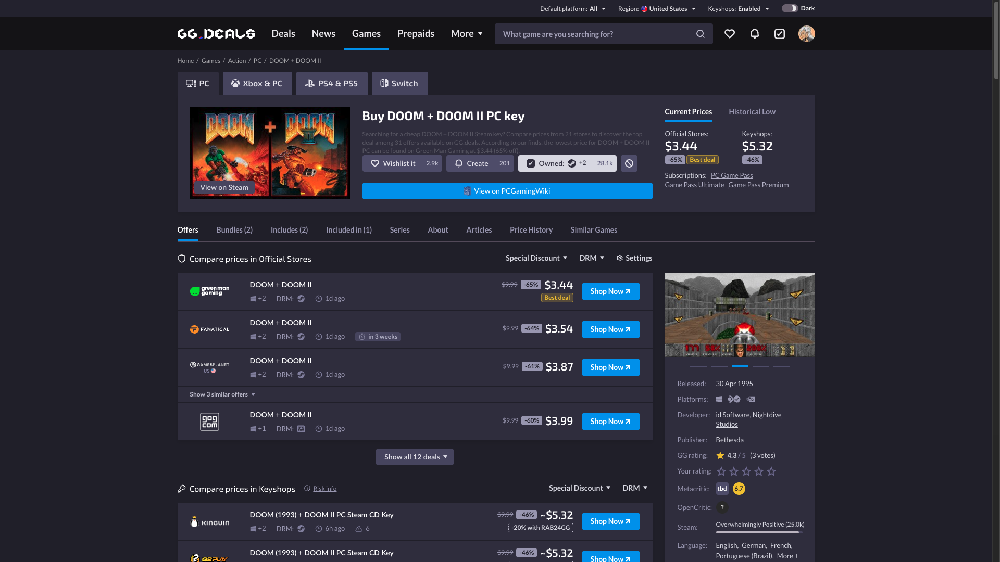
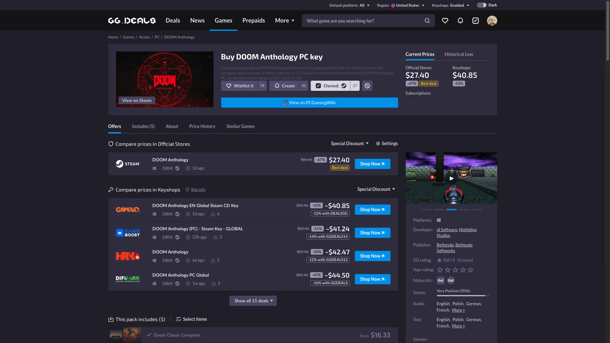
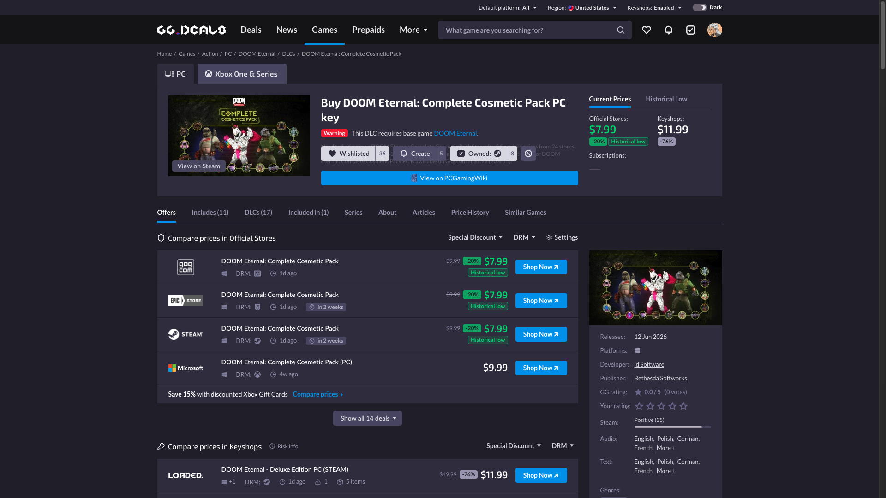

# GGDeals to PCGamingWiki link

Tampermonkey userscript that adds a PCGamingWiki link to GG.deals pages. / Userscript de Tampermonkey que añade un enlace a PCGamingWiki en las páginas de GG.deals.

*Game page (`/game/`): the button spans the actions area, below the wishlist / owned controls. / Página de juego (`/game/`): el botón ocupa la zona de acciones, bajo los controles de lista de deseos / en propiedad.*

*It works the same on packs (`/pack/`) and DLC (`/dlc/`). / Funciona igual en packs (`/pack/`) y DLC (`/dlc/`).*

## English

### What it does

- Adds a **View on PCGamingWiki** button to GG.deals **game** (`/game/`), **pack** (`/pack/`) and **DLC** (`/dlc/`) pages, linking to **[PCGamingWiki](https://www.pcgamingwiki.com/)** — fixes, technical notes, ports and known issues.
- **It only appears on PC.** GG.deals lists the same product for several platforms and PCGamingWiki only covers PC, so the script checks the platform first — in the breadcrumb, in the active platform badge and in the OS selector — and stays out of the way on the Xbox, PlayStation or Switch tabs.
- **It cleans the title before searching.** GG.deals titles a page something like `Buy Cheap DOOM Eternal PC key 🏷️ Best Price | GG.deals`; the script strips the commercial wrapping and leaves the game's name. Punctuation becomes spaces rather than being deleted, because PCGamingWiki's search splits on punctuation the same way — that is what keeps `Tomb Raider IV-VI` from collapsing into `IVVI` and `Marvel's` into `Marvels`.
- **The link is a title search, not a direct page,** and the button says so in its tooltip. PCGamingWiki runs on MediaWiki and its search is imprecise, so it can land on a list of results or on the wrong game. Saying it up front stops that reading like a bug in the script.
- The button uses GG.deals' own action-button classes so it matches the page, and the PCGamingWiki logo travels **inline as SVG**: GG.deals sends a strict `img-src 'self'` policy that blocks external images and even `data:` URIs, so any other way of loading the icon would show nothing at all.
- Opens in a new tab, with `rel="nofollow noopener external"`.

**Language:** none — the label and the tooltip are in English on purpose: `PCGamingWiki` is a brand name and the button is a single phrase.

**Install:**
1. Install [Tampermonkey](https://www.tampermonkey.net/).
2. Open the installer: [ggdeals-to-pcgamingwiki.user.js](https://github.com/g31w0fw0rld/ggdeals-to-pcgamingwiki/raw/main/ggdeals-to-pcgamingwiki.user.js) (also on [GreasyFork](https://greasyfork.org/es-419/users/1590477-g31w) and [OpenUserJS](https://openuserjs.org/users/g31w0fw0rldgmail.com/scripts)).

**Sites:** `gg.deals/game/*`, `gg.deals/pack/*`, `gg.deals/dlc/*`

## Español

### Qué hace

- Añade un botón **View on PCGamingWiki** en las páginas de **juego** (`/game/`), **pack** (`/pack/`) y **DLC** (`/dlc/`) de GG.deals, enlazando a **[PCGamingWiki](https://www.pcgamingwiki.com/)** —arreglos, notas técnicas, ports y problemas conocidos—.
- **Solo aparece en PC.** GG.deals lista el mismo producto para varias plataformas y PCGamingWiki solo cubre PC, así que el script comprueba antes la plataforma —en las migas de pan, en el badge de plataforma activo y en el selector de sistema— y no estorba en las pestañas de Xbox, PlayStation o Switch.
- **Limpia el título antes de buscar.** GG.deals titula la página con algo como `Buy Cheap DOOM Eternal PC key 🏷️ Best Price | GG.deals`; el script quita el envoltorio comercial y deja el nombre del juego. La puntuación pasa a espacios en vez de borrarse, porque el buscador de PCGamingWiki separa por puntuación igual — eso es lo que evita que `Tomb Raider IV-VI` acabe como `IVVI` y `Marvel's` como `Marvels`.
- **El enlace es una búsqueda por título, no una página directa,** y el botón lo dice en su tooltip. PCGamingWiki corre sobre MediaWiki y su buscador es impreciso, así que puede caer en una lista de resultados o en el juego equivocado. Decirlo de antemano evita que eso se lea como un fallo del script.
- El botón usa las clases de acción propias de GG.deals para que combine con la página, y el logo de PCGamingWiki viaja **como SVG en línea**: GG.deals envía una política estricta `img-src 'self'` que bloquea imágenes externas e incluso los `data:` URI, así que cualquier otra forma de cargar el icono no mostraría nada.
- Abre en una pestaña nueva, con `rel="nofollow noopener external"`.

**Idioma:** ninguno — la etiqueta y el tooltip están en inglés a propósito: `PCGamingWiki` es una marca y el botón es una sola frase.

**Instalación:**
1. Instala [Tampermonkey](https://www.tampermonkey.net/).
2. Abre el instalador: [ggdeals-to-pcgamingwiki.user.js](https://github.com/g31w0fw0rld/ggdeals-to-pcgamingwiki/raw/main/ggdeals-to-pcgamingwiki.user.js) (también en [GreasyFork](https://greasyfork.org/es-419/users/1590477-g31w) y [OpenUserJS](https://openuserjs.org/users/g31w0fw0rldgmail.com/scripts)).

**Sitios:** `gg.deals/game/*`, `gg.deals/pack/*`, `gg.deals/dlc/*`

## Privacy / Privacidad

**EN:** the script makes no network requests and stores nothing: it only reads the page's own title and platform to build the link and insert the button. It declares `@grant none`, so it has no access to the userscript manager's privileged APIs (storage, cross-origin requests). Nothing is sent to third parties or to the author, and you only visit PCGamingWiki if you click the button.

**ES:** el script no hace ninguna petición de red ni guarda nada: solo lee el título y la plataforma de la propia página para construir el enlace e insertar el botón. Declara `@grant none`, así que no tiene acceso a las APIs privilegiadas del gestor de userscripts (almacenamiento, peticiones entre dominios). No se envía nada a terceros ni al autor, y solo visitas PCGamingWiki si haces clic en el botón.

## Support / Apoyar

This is part of something I'm building to grow. If it helps you and you'd like to support it, you can tip me on **[Ko-fi](https://ko-fi.com/g31w0fw0rld)** —only if you want—; and if a cause needs it more than I do, help that one instead.

Esto es parte de algo que estoy construyendo para crecer. Si te sirve y quieres apoyar, puedes invitarme un café en **[Ko-fi](https://ko-fi.com/g31w0fw0rld)** —solo si quieres—; y si hay una causa que lo necesite más que yo, ayúdala a ella.

---
Author / Autor: **g31w0fw0rld** · License / Licencia: **MIT**
